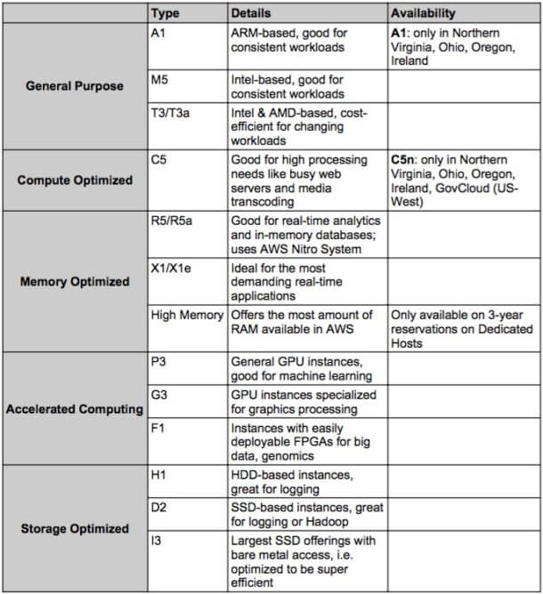

# EC2

Types of **EC2** based on compute resources [Details](https://cloudacademy.com/blog/aws-ec2-instance-types-explained/).

## AWS Savings Plans

EC2 offer clients **with regular usage expectations** the opportunity to lock in significant discounts off On-Demand pricing in return for commiting to **one or three-year** terms of use. If you’re able to pay part or all of this cost up front, AWS will tack on an additional discount.

EC2 Instance [Savings Plans](https://aws.amazon.com/savingsplans/compute-pricing/) offer even steeper **discounts but are less flexible**. First of all, Fargate customers can’t use these plans, and **you’re locked into a specific EC2 Instance family and region for the duration of your term**. However, these discounts can reach as high as **72 percent**, so if you’re sure you’ll use the instances, this is a great option.

## Spot Instances

[Spot Instances](https://www.cloudforecast.io/blog/are-aws-spot-instances-worth-it-in-production/) are another way to purchase computing power at a steep discount. AWS allows **customers to purchase unused capacity**, but if the capacity is purchased by another user, **it will be reclaimed with a two-minute warning**. These discounts change slowly based on market demand; currently they are 67 percent for Fargate compute and up to 90 percent for EC2 Instances.

## AWS ECS Container Optimization

### Right Sizing

### Auto Scaling

### AWS ECS Container Consolidation

