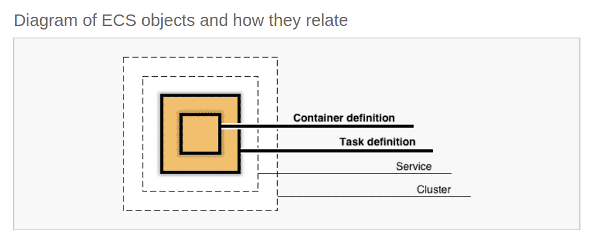

## ECS

> With AWS ECS pricing, you only pay for the underlying resources your containers use.

The primary service for running Docker containers on AWS is ECS. Other container offerings like AWS Fargate and AWS Batch add automated container orchestration on top of ECS.

You can also choose the **AWS EC2 launch type**, which will be familiar to many AWS users. Under this model, you pay for the AWS EC2 instances and **attached EBS volumes that you select to run your containers**. You can get bigger discounts with this model, but because instances are a fixed size, you have to be relatively certain about the requirements of your containers and avoid choosing an EC2 instance that’s too large or small.

- Image
- Task Definition
  
  Necesitas definir un Task Definition (JSON file) para describir uno o más Containers (hasta 10) para definir todos los parámetros, CPU, Docker image y demás.

- Cluster
  
  El componente principal es el cluster siendo un grupo de EC2 para tener HA. Cada instancia tiene que tener un Container Agent que es el encargado de Attach la intancia al Cluster. ECS optimcize AIM que vienen con todo lo necesario para ejecutarlo Docker dentro.

- Service
  
  Te permite ejecutar un numero de task dentro del cluster.

- Capacity provider
  
  Para el Auto Scaling Group para tener cuantas EC2 intances puedo tener en el cluster.

- [Network Mode](https://docs.aws.amazon.com/AmazonECS/latest/developerguide/task-networking.html) 
- Logging driver

Hay que desplegarlo detrás de un LB.

[Application Load Balancer](https://docs.aws.amazon.com/elasticloadbalancing/latest/application/introduction.html)

 export TF_VAR_rds_password=foobarbaz
terraform graph | dot -Tpng > infrastructure_graph.png

psql -U sbri -h sbri-db.cariaknc5efm.eu-west-2.rds.amazonaws.com -p 5432 sbri

terraform destroy -target=aws_ecs_service.sbri-backend -target=aws_ecs_task_definition.sbri-backend -target=module.vpc.aws_eip.nat -target=aws_lb.sbri-lb -target=aws_autoscaling_group.ecs-cluster

