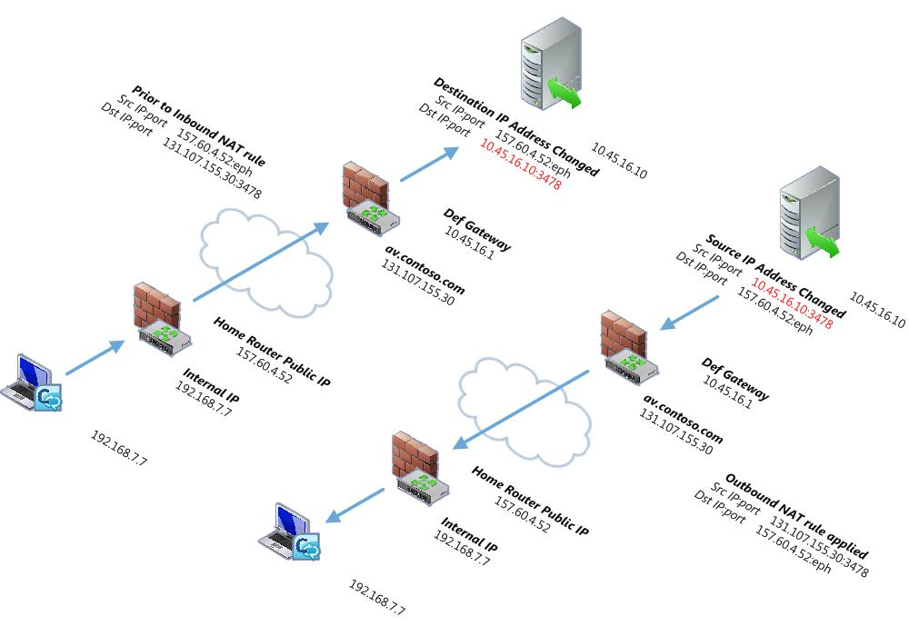

## Configuration

```bash
# configure aws for specific user
aws configure --profile profile-name
# user connected
aws --profile name sts get-caller-identity

# EC2 
aws --profile name ec2 describe-instances --query "Reservations[].Instances[].[Tags[?Key=='Name'],InstanceId,State.Name]" --output text
aws --profile name ec2 start-instances --instance-ids ID
aws --profile name ec2 stop-instances --instance-ids ID
aws --profile sbri ec2 describe-instances --query "Reservations[].Instances[].[PublicIpAddress]" --output text
# RDS start & stop
aws --profile name rds stop-db-instance --db-instance-identifier name
aws --profile name rds start-db-instance --db-instance-identifier name
```
## 

- [[EC2 | cloud.aws.ec2]]
- [[ECS | cloud.aws.ecs]]
- [[ECR | cloud.aws.ecr]]

## Core services for Web App

<u>Static Content</u>

Amazon S3 --> For store static content files.
Amazon Cloudfront --> Chaching for access the application frontstored in S3

<u>Domain management</u>

Amazon Route 53 --> DNS Services, API Routes, Register domain.

<u>API Hosting</u>

Amazon API Gateway + AWS Lambda --> Register a function and upload Lambda and redirect to GW
Aplication Load Balancer + Amazon EC2 --> Deploy inside EC2 a redirecto to LB
Aplicacion Load Balancer + Amazon ECS --> Deploy with Docker images

<u>Database</u>

Amazon RDS --> Typicall SQL servers
Amazon Redshift (BI) --> Very heavy querys and analytics, for huge data and join columns.
Amazon DynamoDB --> NoSQL database (key,value)
Amazon ElasticCache --> Redis, Memcache for store database
Amazon Neptune --> Graph database

<u>Application Orchestration/Coordination</u>

Amazon SNS --> Connect one service to others with some restrictions or rules
Amazon SQS --> Connect one service to others with some restrictions or rules
AWS Step Functions --> Workflow processing or sequence

<u>Analytics, Big Data, ML</u>

Amazon Athnena --> Querys over S3 for analytics
Amazon Quick Sight -> Tableau or PowerBI, build dashboards(BI Tool)
Amazon EMR --> Map Reduce jobs
Amazon Sagemaker --> Build ML with Notebooks

<u>Security</u>

Amazon VPC --> Build digital Firewall around AWS resources, how to access to our applications, ports
AWS IAM --> Configure access for specific resources

<u>Monitoring</u>

Amazon CloudWatch --> Log applications, monitoring, alarms
AWS Cloudtrail --> When you have many users and need track them 


## Traffic

- **Inbound** : Data _inbound_ **to Amazon** (that is, packet data that is **destined for the Amazon** cloud servers; for example, uploads and client requests) are free. 
- **Outbound**: Data _outbound_ **from Amazon** is billed (that is, downloads from the cloud and **responses to client requests**).



- Calculate [Data Tansfer](https://aws.amazon.com/ec2/pricing/on-demand/#Data_Transfer) for IN/OUT and in different Regions.

# RDS

[Pricing comparing instances](https://instances.vantage.sh/rds/?region=eu-west-1)

- **RDS** Instance Types based on prices [Prices](https://aws.amazon.com/rds/instance-types/).

# EBS

- General Purpose SSD (gp2) Volumes: General Purpose SSD (gp2) volumes are the most common volume type. They were designed to be a **cost-effective storage** option for a wide variety of workloads. Gp2 volumes cover system volumes, dev and test environments, and various low-latency apps. They have a decent IOPS (starting from 100 and going all the way to 16000 IOPS) and a maximum throughput of 250MiB/s. You can combine multiple EBS volume types in a RAID to achieve even higher performance on a single instance.

- Provisioned IOPS SSD (io1) Volumes: Provisioned IOPS SSD (io1) EBS volume types are a special type of volume created to fulfill the needs of **very intensive I/O workloads** that require very high throughput. They are useful for cases which are latency-sensitive, like **large database** workloads (e.g., MySQL, Cassandra, MongoDB, and Oracle) and critical business applications that need the kind of sustained performance gp2 volumes can’t achieve.

- Throughput Optimized HDD (st1) Volumes: Throughput Optimized HDD (st1) volumes are a type of volume that offers **low-cost storage** while fulfilling the need for sequential workloads that require more throughput than IOPS. When working with **data warehouses**, log processing, **ETL** (extract, transform, load) or AWS EMR, this is a volume type to look into. Keep in mind that this volume type **cannot be used as a boot volume**.

### What is an IOPS AWS?

IOPS is an acronym for **input/output operations per second** and is a popular performance metric used to distinguish one storage type from another. Similar to device makers, AWS associates IOPS values to the volume component backing the storage option. Provisioned IOPS are an AWS EBS volume type designed to deliver predictable, high-level performance for I/O intensive workloads such as database applications.

IOPS usage can be simply calculated by knowing the total read and write throughputs (ops) of your disk divided by the time in seconds within that period.

> **_NOTE:_** IOPS Usage = (Total Read + Write Throughputs) / Time (in Seconds)

Example: IOPS = ( 15000 + 100 ) / 300 = 

# EKS
aws eks --region eu-west-1 update-kubeconfig --profile utile
